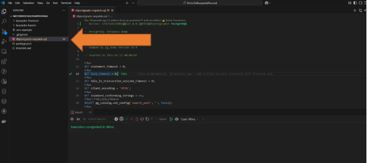
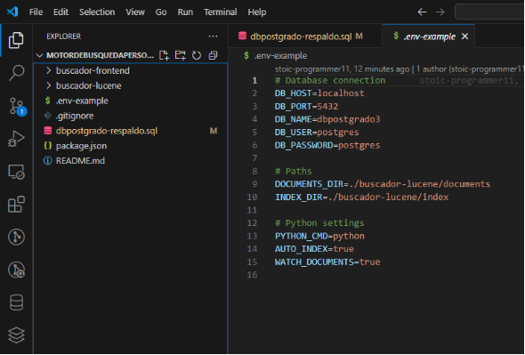
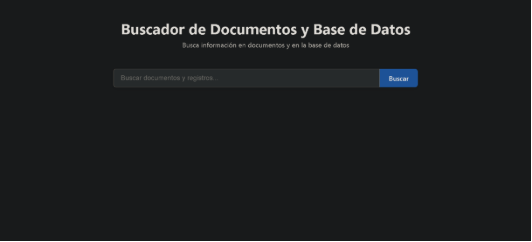

# Guia de Instalacion - Buscador

## Requisitos de Software

### Core

- **Node.js** (versión 16.x o superior)
- **Python** (versión 3.7 o superior)
- **PostgreSQL** (base de datos)
- **npm** o **yarn** (gestor de paquetes)

### Entorno de Python

- **PyLucene** (versión 9.0.0)
- **Bibliotecas adicionales de Python**:
  - [PyPDF2](https://pypi.org/project/PyPDF2/) (versión 3.0.1) - Para extraer texto de archivos PDF
  - python-docx (versión 0.8.11) - Para extraer texto de documentos Word
  - [psycopg2-binary](https://pypi.org/project/psycopg2-binary/) (versión 2.9.5) - Para conexión con PostgreSQL
  - python-dotenv (versión 1.0.0) - Para manejo de variables de entorno
  - [openpyxl](https://pypi.org/project/openpyxl/) - Para procesar archivos Excel
  - python-pptx - Para procesar presentaciones PowerPoint

## Pasos de Instalación

1. **Crea la base de datos "dbpostgrado3", luego ejecutar el script de respaldo "dbpostgrado-respaldo.sql"**

   

2. **Crea el archivo .env con tus configuraciones en base al .env-example, en caso de tener las configuraciones por defecto copiar el .env tal como esta:**

   

3. **Instalar Dependencias Python:**

   ```bash
   cd buscador-lucene
   pip install -r python/requirements.txt
   ```

4. **Instalar Dependencias del Backend:**

   ```bash
   cd buscador-lucene
   npm install
   ```

5. **Instalar Dependencias del Frontend**

   ```bash
   cd buscador-frontend
   npm install
   ```

## Iniciar la Aplicación

Para ejecutar el sistema completo, necesitas iniciar tanto el backend como el frontend.

1. **Iniciar el Backend**

   En una terminal, navega a la carpeta del backend y ejecuta:

   ```bash
   cd buscador-lucene
   npx ts-node src/server.ts
   ```

2. **Iniciar el Frontend**

   En otra terminal, navega a la carpeta del frontend y ejecuta:

   ```bash
   cd buscador-frontend
   npm run dev
   ```

La interfaz de usuario estará disponible en [http://localhost:5173](http://localhost:5173)



## Uso Básico

1. Abre tu navegador y accede a [http://localhost:5173](http://localhost:5173)
2. Verás la interfaz de búsqueda con un campo de texto
3. Ingresa el término de búsqueda y presiona "Buscar"
4. Los resultados mostrarán coincidencias encontradas en:
   - Base de datos PostgreSQL (todas las tablas y columnas)
   - Documentos de texto (.txt)
   - PDFs (.pdf)
   - Documentos Word (.docx, .doc)
   - Hojas de cálculo Excel (.xlsx, .xls)
   - Presentaciones PowerPoint (.pptx, .ppt)

## Añadir Documentos

Para incluir documentos en la búsqueda:

1. Coloca los archivos en la carpeta buscador-lucene/documents
2. Los documentos serán indexados automáticamente

